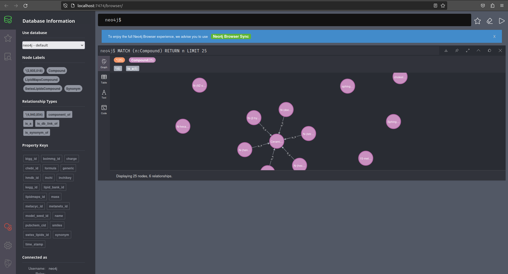

# Lipid Genomic Metabolic Models Annotator Lipid_GEMA
### Description 

One of the key challenges in lipid analysis is the absence of comprehensive annotations for GSM models with defined structural representations. This gap limits the ability to validate and correlate experimental data with the lipid models under investigation. Lipid_GEMA aims to overcome this hurdle by offering a powerful annotation framework tailored specifically for these models.

Lipid_GEMA is a powerful annotation tool designed to streamline lipid analysis and annotation processes. Built with a comprehensive database utilizing Lipid Maps and Swiss Lipids information, this tool combines python algorithm with extensive lipid knowledge to provide accurate and efficient annotations.
At his core lies a robust graph database meticulously constructed to store a complex collection of lipid data. Leveraging the rich resources provided by Lipid Maps and Swiss Lipids, the database emcompasses a wide range of lipid entities, ensure comprehensive coverage across various lipid classes, subtypes, and structural variations. 

The Python pipeline employed by Lipid_GEMA serves as a critical component, enabling seamless connectivity between the user and the database. Through advanced matching techniques, the algorithm efficiently identifies and retrieves relevant lipid information from the database. Moreover this information is used to perform the annotation of structurally defined lipids facilitating accurate mapping and validation of lipidomics data. 

### Features:
- Database Integration
- Comprehensive Lipid Coverage
- Efficient Annotation Workflow

# Set-up

Lipid-GEMA can be acessed remotly or recreated in your local machine. For the last one the following steps need to be fulfill.

Necessary software:
- Docker
- Python
- Git
* [![Next][Next.js]][Next-url]
* [![React][React.js]][React-url]
* [![Vue][Vue.js]][Vue-url]
* [![Angular][Angular.io]][Angular-url]
* [![Svelte][Svelte.dev]][Svelte-url]
* [![Laravel][Laravel.com]][Laravel-url]
* [![Bootstrap][Bootstrap.com]][Bootstrap-url]
* [![JQuery][JQuery.com]][JQuery-url]

## Setup database

Firstly it is necessary to clone this repository in order to have the docker-compose file that will handle the comunication between the Lipid_GEMA database and the annotation tool. 
This will configure a multiple container application and their dependencies using a single file, making it easier to manage interconnected services. 
Create, or navigate to a folder of your choice and in the command line and paste the following command.

```bash
git clone https://github.com/AdrianoSilva19/Lipid_GEM.git
```

Navigate to the Database subdirectory inside the Lipid_GEM folder to get acess to the docker-compose file.
Now you need to download the backup files from the original database to populate a local copy of it. Here is the link to get the files: ??

Now we need to create and populate the Lipid_GEMA database. To create the database we only need to run  the docker-compose that will get you the necessary images to create a database with the necessary configurations to handle the Lipid_GEMA data. To this you will need to acess the Database folder and past the following command:

```bash
docker-compose up -d
```

In neo4j, to populate a database with the backup files it is necessary to shutdown the target database. In this case you will need to stop the database-lipid_gem-1 container and perform the switching of the db files with the backup ones.

In linux command line use the following code:
```bash
docker stop database-lipid_gem-1

docker run --rm -v $(pwd):/backup -v /Lipid_GEM:/data debian:jessie bash -c "cd /data && tar xvf /backup/backup.tar --strip 1"

docker start database-lipid_gem-1 
```

For windows command line:
```bash
docker stop database-lipid_gem-1

docker run --rm -v %cd%:/backup -v /Lipid_GEM:/data debian:jessie bash -c "cd /data && tar xvf /backup/backup.tar --strip 1"

docker start database-lipid_gem-1
```

Now at the starting of the lipid_gem database container a local copy of Lipid_GEMA db will be stored. To confirm this one can acess the logs of the container and check if the remote neo4j interface is acessible, or acess the graphical interface in http://localhost:747/. In this interface it will be possible acess all Lipid_GEMA database as represented in the screenshot. 



## Run Annotator algorithm

Now that the database container is working it is possible to activate the Annotator algorithm. To activate the code_container it is necessary to restart the code container created by the docker-compose up command.

```bash
docker start database_code_container_1 
```

Annotated models will be presented in the Annotation/models/models_annotated and the results will be in Annotation/models/results, with the xlsx file with all lipid classes present in the models and wich were annotated, and a text file with all the annotation suggested. The txt file it gives the model lipid id and the annotations suggestions (online database lipid id), with this information one can manually curate and corroborate the results.

In addition new models put under the models_case_study folder will be annotated as well. This will allow you to explore the Lipid_GEMA in another models and test the tool's limits. Keep in mind that you will always need to corroborate the results of these models with the information given in the Text files. 


